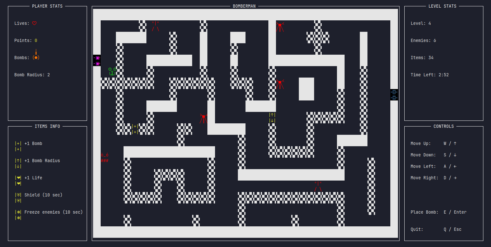

# Bomberman Project

Progetto universitario che implementa un gioco **Bomberman** basato su terminale in **C++** utilizzando la libreria **ncurses**.

## Panoramica del progetto

L’obiettivo del progetto è ricreare le meccaniche principali del **classico gioco Bomberman** in un ambiente terminale testuale. Il gioco include movimento del giocatore, posizionamento delle bombe, esplosioni, ostacoli distruttibili e interazione con i nemici.

Il gioco include anche un **menu iniziale** che permette al giocatore di avviare una nuova partita, visualizzare la classifica o uscire dall’applicazione.

Inoltre, il progetto implementa un **sistema di classifica permanente**, che memorizza e mostra i migliori punteggi dei diversi giocatori tra una sessione e l’altra.

Ecco un esempio della schermata di gioco principale:

> 

## Demo

Una breve demo del gameplay è disponibile qui:

- https://www.youtube.com/watch?v=ie1Yo_5zqFQ

## Requisiti

- Compilatore C++ compatibile (GCC / Clang)
- CMake
- ncurses
- git

### Installazione dipendenze (se mancanti)

#### Ubuntu / Debian

```bash
sudo apt update
sudo apt install build-essential cmake git libncurses-dev
```

#### Arch Linux

```bash
sudo pacman -S base-devel cmake git ncurses
```

#### macOS (Homebrew)

```bash
brew install cmake git ncurses
```

## Clone

```bash
git clone https://github.com/andreaamanzo/bomberman-project.git
cd bomberman-project
```

## Build

```bash
cmake -S . -B build
cmake --build build
```

## Run

```bash
./build/Bomberman
```

## Struttura del progetto

```text
.
├── include/         # File header
├── levels/          # Mappe dei livelli di gioco
├── NcWrapper/       # Wrapper ncurses e utility di rendering
├── src/             # Codice sorgente principale del gioco
├── state/           # Dati persistenti del gioco (classifica)
├── report/          # Sorgenti del report LaTeX del progetto 
├── CMakeLists.txt   # Configurazione di build
├── README.md
└── report.pdf       # Report del progetto
```

## Report

Il report completo del progetto è disponibile in formato PDF:

- `report.pdf`

## Contatti

- Andrea Manzo  
  Email: andrea.manzo4@studio.unibo.it  

- Tommaso Lissandrin  
  Email: tommaso.lissandrin@studio.unibo.it 

- Alessandro Godani  
  Email: alessandro.godani@studio.unibo.it
